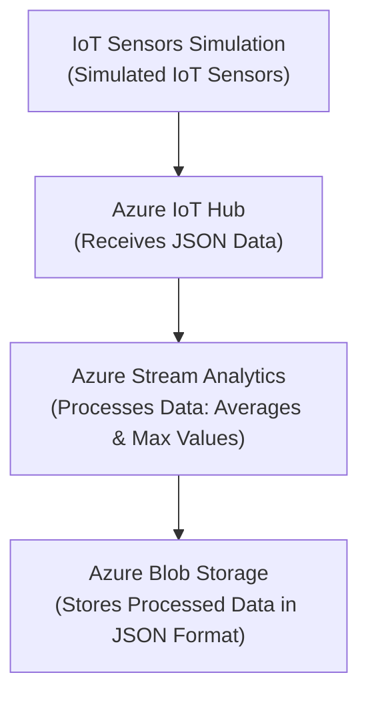

# Rideau Canal Skateway Monitoring System

## **Scenario Description**
The Rideau Canal Skateway, a world-renowned attraction in Ottawa, requires constant monitoring to ensure the safety of skaters. This system simulates IoT sensors at three key locations (Dow's Lake, Fifth Avenue, NAC) to monitor ice thickness, surface temperature, snow accumulation, and external temperature. The data is processed in real time to detect unsafe conditions, stored in Azure Blob Storage for further analysis, and provides aggregated insights for decision-making.

## **System Architecture**
The system processes real-time data using the following components:

1. **IoT Sensors Simulation**:
   - Simulated IoT sensors send JSON data every 10 seconds.
   - Data includes metrics like ice thickness, snow accumulation, and weather conditions.
2. **Azure IoT Hub**:
   - Receives and routes sensor data for real-time processing.
3. **Azure Stream Analytics**:
   - Processes incoming data to compute averages and maximum values over a 5-minute tumbling window.
4. **Azure Blob Storage**:
   - Stores processed data for analysis in JSON format.

### **Architecture Diagram**



## **Implementation Details**

### **IoT Sensor Simulation**
- **Data Simulation**:
  The simulated sensors send data every 10 seconds in the following format:
  ```json
  {
    "location": "Dow's Lake",
    "iceThickness": 27,
    "surfaceTemperature": -1,
    "snowAccumulation": 8,
    "externalTemperature": -4,
    "timestamp": "2024-11-23T12:00:00Z"
  }
  ```
- **Python Script**:
  The simulation is implemented using three separate Python scripts for each location (`sensor_dows_lake.py`, `sensor_nac.py`, `sensor_fifth_avenue.py`).

### **Azure IoT Hub Configuration**
1. **Create IoT Hub**:
- Create an IoT Hub, and register three devices (e.g., `DowLakeDevice`, `FifthAveDevice`, `NACDevice`).
- In the Azure Portal, search for IoT Hub and click Create.
- Provide a name for your IoT Hub and select a resource group.
- Choose the Free Tier (if available) for testing purposes and create the IoT Hub.

2. **Connection Strings**:
- In the IoT Hub, go to the Devices section and click Add Device.
- Provide a Device ID (e.g., DowLakeDevice) and click Save.
- After the device is created, click on it to view the connection string. Copy the connection string for use in the Python script that going to simulate the sensor.

  
3. **Install Required Libraries**:
Use the following Python script to simulate telemetry data and send it to the IoT Hub. Replace the CONNECTION_STRING with the device connection string you copied earlier.
    ```bash 
   pip install azure-iot-device
   ```
4. **Run the Python Script to Simulate Sensor Data**
Install the azure-iot-device library to simulate sensor data. Run the following command:

   **Note** : **Below is the code for Dow's Lake. We will be running the similar code for Fifth Avenue, NAC just by replacing the connection string with respective IoT hub connection string from azure IoT device.**
   #### Script 1: Dow's Lake (simulate_dows_lake.py)
      ```python
      import time
      import random
      from azure.iot.device import IoTHubDeviceClient, Message

      # Replace with your IoT Hub device connection string for Dow's Lake
      CONNECTION_STRING = "Your IoT Hub connection string for Dow's Lake"

      def get_telemetry():
         return {
            "location": "Dow's Lake",
            "iceThickness": round(random.uniform(15.0, 35.0), 2),
            "surfaceTemperature": round(random.uniform(-5.0, 5.0), 2),
            "snowAccumulation": round(random.uniform(0.0, 15.0), 2),
            "externalTemperature": round(random.uniform(-10.0, 10.0), 2),
            "timestamp": time.strftime("%Y-%m-%dT%H:%M:%SZ", time.gmtime())
         }

      def main():
         client = IoTHubDeviceClient.create_from_connection_string(CONNECTION_STRING)
         try:
            print("Sending telemetry for Dow's Lake...")
            while True:
                  telemetry = get_telemetry()
                  message = Message(str(telemetry))
                  client.send_message(message)
                  print(f"Sent: {message}")
                  time.sleep(10)
         except KeyboardInterrupt:
            print("Stopped sending messages.")
         finally:
            client.disconnect()

      if __name__ == "__main__":
         main()
      ```
   This Python script simulates an IoT device sending telemetry data about Dow's Lake to an Azure IoT Hub. It generates random metrics like ice thickness, snow accumulation, and temperatures using the get_telemetry function and sends these as JSON-formatted messages every 10 seconds. The IoTHubDeviceClient handles communication with the IoT Hub, using a connection string for authentication. The script gracefully exits and disconnects the client upon receiving a keyboard interrupt.

   **5. Run the Script** :
   Execute the script to start sending telemetry data to your IoT Hub.
   Run each simulation script:
   ```bash
   python sensor_dows_lake.py
   python sensor_nac.py
   python sensor_fifth_avenue.py
   ```
### **Azure Stream Analytics Job**

#### 1. Create the Stream Analytics Job
- In the Azure Portal, search for **Stream Analytics jobs** and click **Create**.
- Provide a **name** for your job and select the appropriate **resource group**.
- Choose **Cloud** as the hosting environment and create the job.

#### 2. Define Input
- In the Stream Analytics job, navigate to the **Inputs** section and click **Add**.
- Select **IoT Hub** as the input source.
- Fill in the following details:
  - **IoT Hub Namespace**: Select your IoT Hub.
  - **IoT Hub Policy Name**: Use the `iothubowner` policy.
  - **Consumer Group**: Use `$Default` or create a new consumer group in your IoT Hub.
  - **Serialization Format**: Choose **JSON**.

#### 3. Define Output
- Navigate to the **Outputs** section and click **Add**.
- Select **Blob Storage** as the output destination.
- Fill in the following details:
  - **Storage Account**: Select your Azure Storage Account.
  - **Container**: Create or choose an existing container for storing results.
  - **Path Pattern**: Optionally define a folder structure (e.g., `output/{date}/{time}`).

#### 4. Write the Stream Analytics Query

Go to the Query tab and replace the default query with the following:

   ```sql
   SELECT
    input.location AS Location,
    AVG(input.iceThickness) AS AvgIceThickness,
    MAX(input.snowAccumulation) AS MaxSnowAccumulation,
    System.Timestamp AS EventTime
   INTO
    [iotoutput]
   FROM
    [iotinput] AS input
   GROUP BY
    input.location, 
    TumblingWindow(Duration(second, 300))
```
#### 5. Save and Start the Job
Save the query and click Start on the Stream Analytics job.

###  Usage Instructions

#### 1. Running IoT Sensor Simulation
#### Step 1: Install Required Library: 
Run the following command to install the necessary Python library:
```bash
pip install azure-iot-device
```
#### Step 2. Update Python Scripts: 
For each sensor script (simulate_dows_lake.py, sensor_nac.py, sensor_fifth_avenue.py):

#### Step3. Run the Simulation Scripts:
Execute the scripts to start sending telemetry data to the IoT Hub. Use the following commands:

```bash
python simulate_dows_lake.py
python sensor_nac.py
python sensor_fifth_avenue.py
```
Open the script in a text editor.
Replace the CONNECTION_STRING variable with the respective Azure IoT Hub device connection string.


#### 2. Azure Blob Storage

- **Data Organization**:
  - Processed data is stored in JSON format under the `iotcontainer/` container.
  - File naming convention: `Filename.json`.


#### 3. Configuring Azure Services
1. Create and configure the IoT Hub with registered devices. We need three iot devices(sensors) to have it set up as shown above.
2. Set up the Stream Analytics job with the query provided above.
3. Ensure the output destination is properly configured to Blob Storage.

#### 4. Accessing Stored Data
1. Navigate to the Azure Blob Storage account.
2. Locate the `iotcontainer/` container.
3. Download and view the JSON files.

### Results
- **Example Output JSON**:
  ```json
  {
    "Location": "Dow's Lake",
    "AvgIceThickness": 25.0069,
    "MaxSnowAccumulation": 14.99,
    "EventTime": "2024-11-25T16:40:00.0000000Z"
  }
  ```
- Aggregated metrics include:
  - Average ice thickness.
  - Maximum snow accumulation.
  - Timestamp of the event.

.png>)

## Reflection
### Challenges:
1. **Configuring IoT Hub**:
   - Adjusting connection strings for multiple devices.
2. **Stream Analytics Query**:
   - Testing and debugging SQL syntax for correct aggregation.
3. **Blob Storage Output**:
   - Ensuring correct folder structure and file naming.

### **Solutions**:
- Clear documentation and testing each component independently ensured success.
- Using sample data and debugging tools helped validate the Stream Analytics job.

---
This README provides a complete overview and step-by-step guide to replicate the Rideau Canal Skateway Monitoring System.
